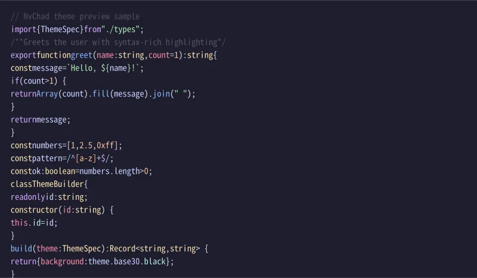
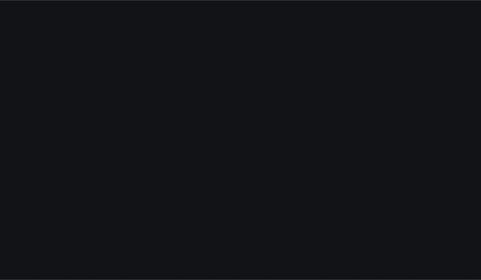

# NvChad Themes

**The complete NvChad theme pack for VS Code, Cursor, and Zed.**

All **94** palettes from [NvChad base46](https://github.com/NvChad/base46) v3.0 — Nord, Catppuccin, Tokyo Night, Gruvbox, Poimandres, **Rxyhn**, and every other upstream theme — ported faithfully to modern editors and CLIs.

[](https://github.com/KitsuneKode/nvchad-themes/actions/workflows/ci.yml)
[](./LICENSE)

## Downloads (no build tools required)

| Platform | Artifact | Install |
|----------|----------|---------|
| **VS Code / Cursor** | [`dist/nvchad-themes-1.0.0.vsix`](./dist/nvchad-themes-1.0.0.vsix) | Extensions → **Install from VSIX…** |
| **Zed (extension)** | [`dist/nvchad-themes-zed-extension-1.0.0.zip`](./dist/nvchad-themes-zed-extension-1.0.0.zip) | Extract → **`zed: install dev extension`** |
| **Zed (user theme)** | [`dist/nvchad-themes-zed-user-1.0.0.json`](./dist/nvchad-themes-zed-user-1.0.0.json) | Copy to `~/.config/zed/themes/` |

Also on [GitHub Releases](https://github.com/KitsuneKode/nvchad-themes/releases/latest). Verify: `sha256sum -c dist/checksums.sha256`

Step-by-step: **[dist/INSTALL.md](./dist/INSTALL.md)** · Publishing: **[PUBLISHING.md](./PUBLISHING.md)**

## Previews

Generated from this repo's theme engine (`bun run previews`). Full VS Code gallery: [`assets/gallery/vscode/`](./assets/gallery/vscode/).

| NvChad Tokyonight | NvChad Kanagawa |
| :---: | :---: |
|  |  |

| NvChad Nord | NvChad Catppuccin |
| :---: | :---: |
|  |  |

| NvChad Rxyhn | NvChad One Dark |
| :---: | :---: |
|  |  |

## Try these themes first

| Theme | Zed picker | VS Code label |
|-------|------------|---------------|
| **NvChad Tokyonight** | `tokyonight` | NvChad Tokyonight |
| **NvChad Kanagawa** | `kanagawa` | NvChad Kanagawa |
| **NvChad Nord** | `nord` | NvChad Nord |
| **NvChad Catppuccin** | `catppuccin` | NvChad Catppuccin |
| **NvChad Rxyhn** | `rxyhn` | NvChad Rxyhn |

Tokyonight and Kanagawa include Zed project-panel git colors aligned with [zed-tokyo-night](https://github.com/ssaunderss/zed-tokyo-night) and [zed-kanagawa](https://github.com/ethangilmore/zed-kanagawa) (dim gitignored paths, yellow modified files).

## Quick install

### VS Code / Cursor

```bash
cursor --install-extension ./dist/nvchad-themes-1.0.0.vsix
code --install-extension ./dist/nvchad-themes-1.0.0.vsix
```

**Preferences: Color Theme** → search **NvChad**. Reload the window if themes do not appear.

### Zed (extension — all 94 themes)

1. Download [`nvchad-themes-zed-extension-1.0.0.zip`](./dist/nvchad-themes-zed-extension-1.0.0.zip) and extract it.
2. The folder you select must contain **`extension.toml`** at the top level:

   ```
   nvchad-themes-zed-extension-1.0.0/
     extension.toml
     themes/
       nvchad-themes.json
     screenshots/
   ```

3. **`zed: install dev extension`** → select that extracted folder.
4. **`zed: reload`**
5. Theme picker → **NvChad Tokyonight** (or any NvChad variant).

**From a clone:**

```bash
bun run install:zed-dev
# Zed: zed: install dev extension → zed-extension/ in this repo
```

Details: [zed-extension/README.md](./zed-extension/README.md)

### Zed (user theme file only)

Copy [`nvchad-themes-zed-user-1.0.0.json`](./dist/nvchad-themes-zed-user-1.0.0.json) to `~/.config/zed/themes/` (macOS: `~/Library/Application Support/Zed/themes/`).

```bash
bun run install:zed --all    # from clone
```

### OpenCode · Gemini CLI · Codex

```bash
bun run install:opencode nord
bun run install:gemini nord
bun run install:codex nord
```

## What's inside

- **74 dark** + **20 light** themes from NvChad base46
- One VSIX with all VS Code color themes
- One Zed extension zip (`extension.toml` + `themes/` + `screenshots/`)
- One Zed user JSON bundle for `~/.config/zed/themes/`
- OpenCode, Gemini CLI, and Codex theme files

<details>
<summary>Full theme list</summary>

**Dark:** `aquarium`, `ashes`, `aylin`, `ayu_dark`, `bearded-arc`, `carbonfox`, `catppuccin`, `chadracula`, `chadracula-evondev`, `chadtain`, `chocolate`, `darcula-dark`, `dark_horizon`, `decay`, `default-dark`, `doomchad`, `eldritch`, `embark`, `everblush`, `everforest`, `falcon`, `flexoki`, `flouromachine`, `gatekeeper`, `github_dark`, `gruvbox`, `gruvchad`, `hiberbee`, `horizon`, `jabuti`, `jellybeans`, `kanagawa`, `kanagawa-dragon`, `material-darker`, `material-deep-ocean`, `melange`, `midnight_breeze`, `mito-laser`, `monekai`, `monochrome`, `mountain`, `neofusion`, `nightfox`, `nightlamp`, `nightowl`, `nord`, `obsidian-ember`, `oceanic-next`, `onedark`, `onenord`, `oxocarbon`, `palenight`, `pastelDark`, `pastelbeans`, `penumbra_dark`, `poimandres`, `radium`, `rosepine`, `rxyhn`, `scaryforest`, `seoul256_dark`, `solarized_dark`, `solarized_osaka`, `starlight`, `sweetpastel`, `tokyodark`, `tokyonight`, `tomorrow_night`, `tundra`, `vesper`, `vscode_dark`, `wombat`, `yoru`, `zenburn`

**Light:** `ayu_light`, `blossom_light`, `catppuccin-latte`, `default-light`, `everforest_light`, `flex-light`, `flexoki-light`, `github_light`, `gruvbox_light`, `material-lighter`, `nano-light`, `oceanic-light`, `one_light`, `onenord_light`, `penumbra_light`, `rosepine-dawn`, `seoul256_light`, `solarized_light`, `sunrise_breeze`, `vscode_light`

</details>

## Development

```bash
bun install
bun run import:base46    # sync palettes from NvChad/base46
bun run build            # regenerate all platform outputs
bun test
bun run previews         # hero WebP/PNG + gallery SVG
bun run package          # build dist/ (VSIX + Zed zip + INSTALL.md)
bun run verify
```

### Distribution layout (`dist/`)

| File | Contents |
|------|----------|
| `nvchad-themes-1.0.0.vsix` | VS Code / Cursor extension |
| `nvchad-themes-zed-extension-1.0.0.zip` | `extension.toml`, `themes/`, `screenshots/` |
| `nvchad-themes-zed-user-1.0.0.json` | Single JSON for `~/.config/zed/themes/` |
| `INSTALL.md` | End-user install guide |
| `checksums.sha256` | SHA-256 of the three artifacts above |

```
src/palettes/       imported base46 JSON
src/derive/         ThemeModel derivation
src/profiles/       hero theme overrides (Tokyo Night, Kanagawa, …)
src/builders/       VS Code, Zed, OpenCode, Gemini, Codex
zed-extension/      Zed dev extension source (bundled into dist zip)
```

## Credits

- Palettes: [NvChad/base46](https://github.com/NvChad/base46) (v3.0)
- Zed reference ports: [zed-tokyo-night](https://github.com/ssaunderss/zed-tokyo-night), [zed-kanagawa](https://github.com/ethangilmore/zed-kanagawa)
- Port & multi-editor mapping: [KitsuneKode](https://github.com/KitsuneKode)

## License

MIT — see [LICENSE](./LICENSE).
