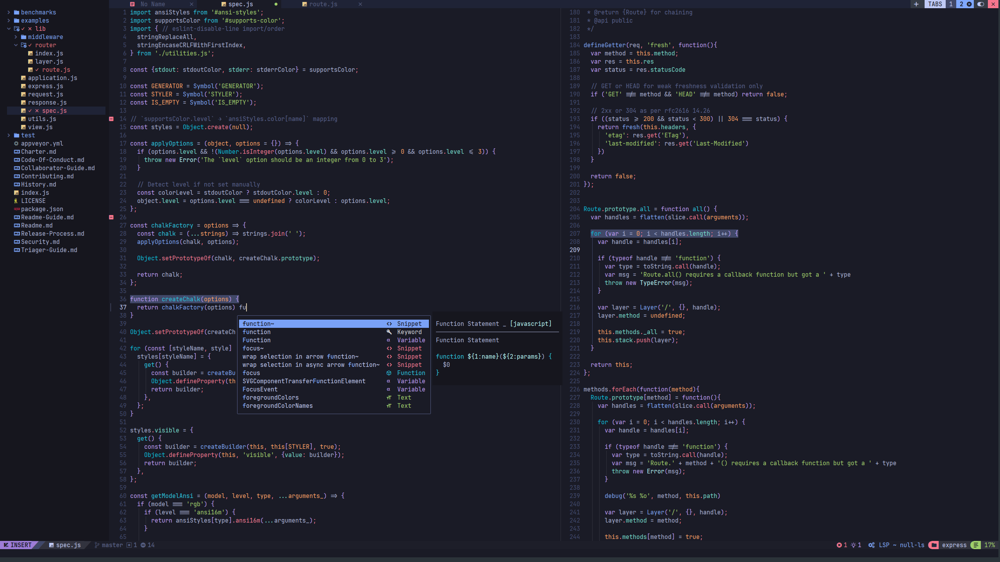
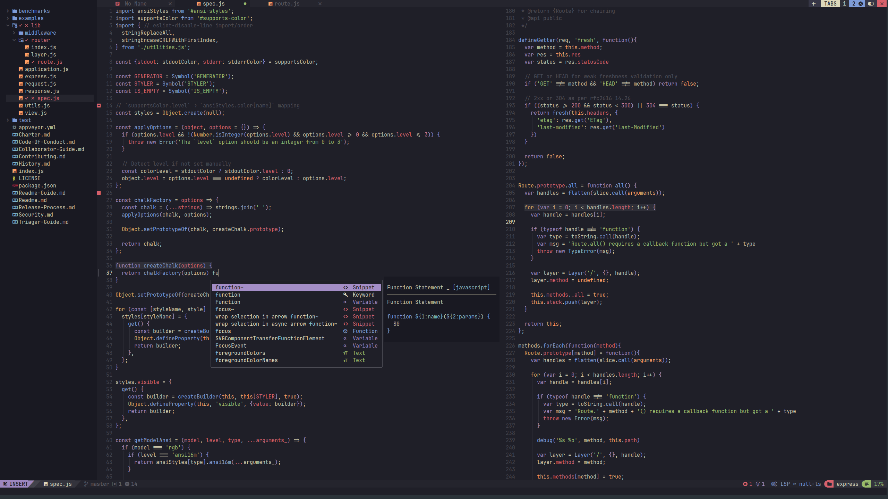
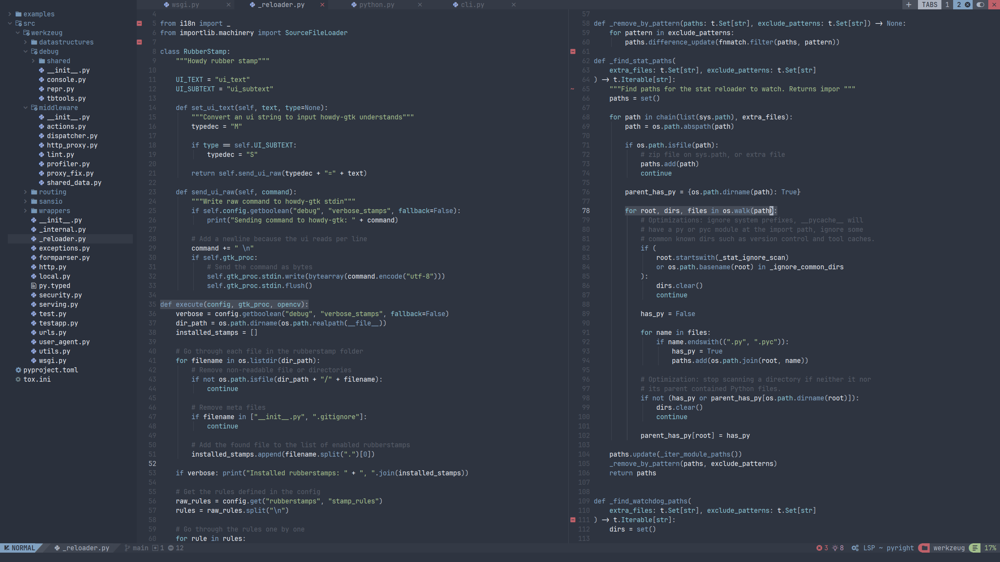
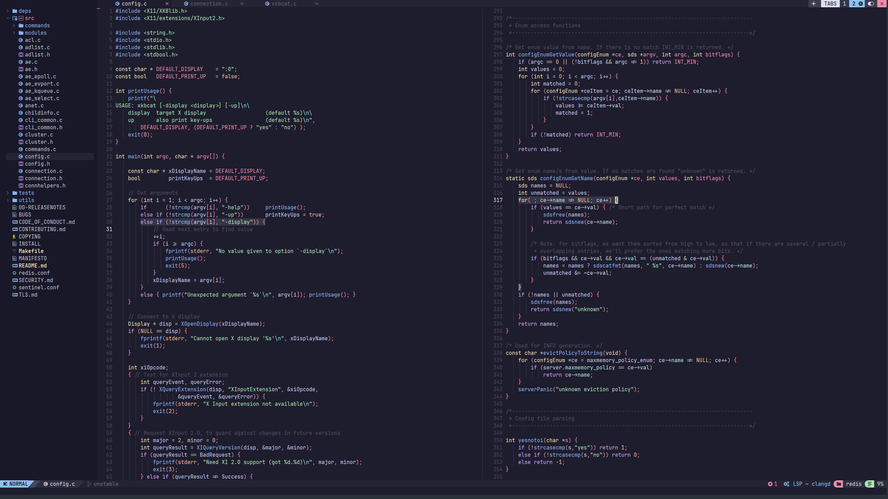
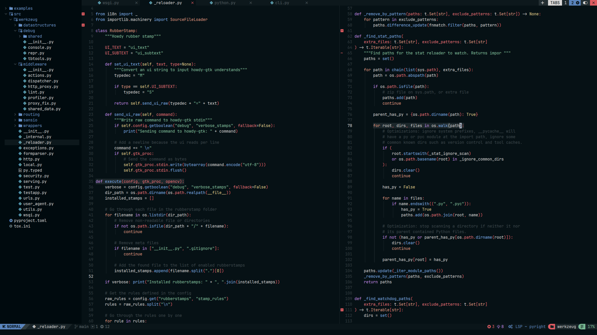
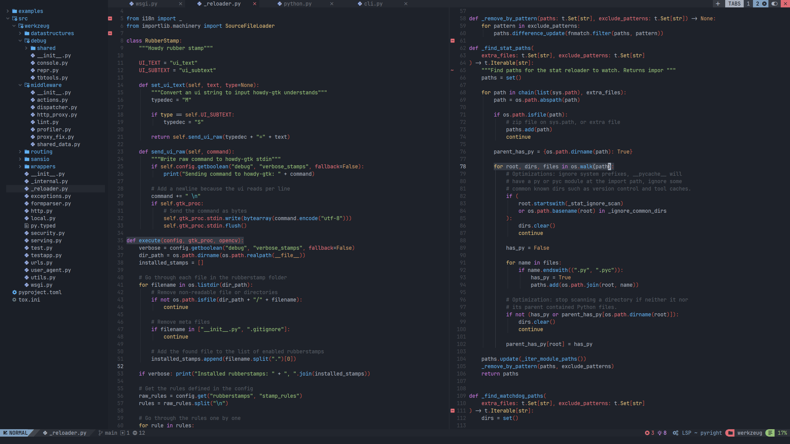

# NvChad Themes

**The complete NvChad theme pack for VS Code, Cursor, and Zed.**

All **94** palettes from [NvChad base46](https://github.com/NvChad/base46) v3.0 — Nord, Catppuccin, Tokyo Night, Gruvbox, Poimandres, **Rxyhn**, and every other upstream theme — ported faithfully to modern editors and CLIs.

[](https://github.com/KitsuneKode/nvchad-themes/actions/workflows/ci.yml)
[](https://github.com/KitsuneKode/nvchad-themes/releases/latest)
[](./LICENSE)

## Downloads

**GitHub Releases** ship VS Code/Cursor and Zed artifacts (no clone required). **OpenCode, Gemini CLI, and Codex** themes are in the repo only — see [INSTALL.md](./INSTALL.md) for automated and manual steps.

| Platform | Artifact | Install |
|----------|----------|---------|
| **VS Code / Cursor** | [`nvchad-themes-1.0.1.vsix`](https://github.com/KitsuneKode/nvchad-themes/releases/latest/download/nvchad-themes-1.0.1.vsix) | Extensions → **Install from VSIX…** |
| **Zed (extension)** | [`nvchad-themes-zed-extension-1.0.1.zip`](https://github.com/KitsuneKode/nvchad-themes/releases/latest/download/nvchad-themes-zed-extension-1.0.1.zip) | Extract → **`zed: install dev extension`** |
| **Zed (user theme)** | [`nvchad-themes-zed-user-1.0.1.json`](https://github.com/KitsuneKode/nvchad-themes/releases/latest/download/nvchad-themes-zed-user-1.0.1.json) | Copy to `~/.config/zed/themes/` |
| **Checksums** | [`checksums.sha256`](https://github.com/KitsuneKode/nvchad-themes/releases/latest/download/checksums.sha256) | `sha256sum -c checksums.sha256` after download |
| **OpenCode** | [`opencode/`](https://github.com/KitsuneKode/nvchad-themes/tree/main/opencode) (repo) | [INSTALL.md — OpenCode](./INSTALL.md#opencode-repo-only--not-a-release-asset) |
| **Gemini CLI** | [`gemini/`](https://github.com/KitsuneKode/nvchad-themes/tree/main/gemini) (repo) | [INSTALL.md — Gemini](./INSTALL.md#gemini-cli-repo-only--not-a-release-asset) |
| **Codex** | [`codex/`](https://github.com/KitsuneKode/nvchad-themes/tree/main/codex) (repo) | [INSTALL.md — Codex](./INSTALL.md#codex-repo-only--not-a-release-asset) |

Full guide (automated **and** manual steps for every platform): **[INSTALL.md](./INSTALL.md)** · Publishing: **[PUBLISHING.md](./PUBLISHING.md)**

## Previews

Hero images are from the [official NvChad theme gallery](https://nvchad.com/themes/) (same base46 palettes as this repo). Sync into the repo with `bun run previews:nvchad` → `assets/previews/nvchad-official/`.

Syntax-accurate editor renders (this repo's VS Code theme engine): `bun run previews` → `assets/previews/*.png` · full gallery: [`assets/gallery/vscode/`](./assets/gallery/vscode/).

| NvChad Tokyonight | NvChad Kanagawa |
| :---: | :---: |
|  |  |

| NvChad Nord | NvChad Catppuccin |
| :---: | :---: |
|  |  |

| NvChad Rxyhn | NvChad One Dark |
| :---: | :---: |
|  |  |

## Try these themes first

| Theme | Zed picker | VS Code label |
|-------|------------|---------------|
| **NvChad Tokyonight** | `tokyonight` | NvChad Tokyonight |
| **NvChad Kanagawa** | `kanagawa` | NvChad Kanagawa |
| **NvChad Nord** | `nord` | NvChad Nord |
| **NvChad Catppuccin** | `catppuccin` | NvChad Catppuccin |
| **NvChad Rxyhn** | `rxyhn` | NvChad Rxyhn |

Tokyonight and Kanagawa include Zed project-panel git colors aligned with [zed-tokyo-night](https://github.com/ssaunderss/zed-tokyo-night) and [zed-kanagawa](https://github.com/ethangilmore/zed-kanagawa) (dim gitignored paths, yellow modified files).

## Quick install

Every platform has **automated** (CLI/script) and **manual** (GUI or copy files) paths. Details and copy-paste commands: **[INSTALL.md](./INSTALL.md)**.

### VS Code / Cursor

**Automated:**

```bash
curl -LO https://github.com/KitsuneKode/nvchad-themes/releases/latest/download/nvchad-themes-1.0.1.vsix
cursor --install-extension nvchad-themes-1.0.1.vsix
code --install-extension nvchad-themes-1.0.1.vsix
```

The `.vsix` file can stay wherever you downloaded it — Cursor/VS Code **extract** it into their extensions folder (you do not need to move the VSIX after install).

| Editor | Installed extension lives at |
|--------|------------------------------|
| **Cursor (Linux)** | `~/.cursor/extensions/kitsunekode.nvchad-themes-1.0.1/` |
| **VS Code (Linux)** | `~/.vscode/extensions/kitsunekode.nvchad-themes-1.0.1/` |
| **Cursor (macOS)** | `~/.cursor/extensions/kitsunekode.nvchad-themes-1.0.1/` |
| **VS Code (macOS)** | `~/.vscode/extensions/kitsunekode.nvchad-themes-1.0.1/` |

Then **Preferences: Color Theme** → search **NvChad** → pick a variant. Reload the window if themes do not appear.

**Manual:** download the [`.vsix` from Releases](https://github.com/KitsuneKode/nvchad-themes/releases/latest/download/nvchad-themes-1.0.1.vsix) → Command palette → **Extensions: Install from VSIX…** → select the file.

### Zed (extension — all 94 themes)

**Automated:**

```bash
curl -LO https://github.com/KitsuneKode/nvchad-themes/releases/latest/download/nvchad-themes-zed-extension-1.0.1.zip
unzip nvchad-themes-zed-extension-1.0.1.zip
# Zed: zed: install dev extension → select extracted folder → zed: reload
```

**Manual:** download the [Zed zip](https://github.com/KitsuneKode/nvchad-themes/releases/latest/download/nvchad-themes-zed-extension-1.0.1.zip), extract, confirm `extension.toml` is at the top level:

```
nvchad-themes-zed-extension-1.0.1/
  extension.toml
  themes/
    nvchad-themes.json
  screenshots/
```

**`zed: install dev extension`** → select that folder → **`zed: reload`** → theme picker → **NvChad Tokyonight** (or any variant).

**From a clone:** `bun run install:zed-dev` → **`zed: install dev extension`** → `zed-extension/` — see [zed-extension/README.md](./zed-extension/README.md).

### Zed (user theme file only)

**Automated:**

```bash
curl -LO https://github.com/KitsuneKode/nvchad-themes/releases/latest/download/nvchad-themes-zed-user-1.0.1.json
mkdir -p ~/.config/zed/themes
cp nvchad-themes-zed-user-1.0.1.json ~/.config/zed/themes/
```

**Manual:** download the [user JSON](https://github.com/KitsuneKode/nvchad-themes/releases/latest/download/nvchad-themes-zed-user-1.0.1.json) and copy to `~/.config/zed/themes/` (macOS: `~/Library/Application Support/Zed/themes/`).

**From a clone:** `bun run install:zed --all` or `bun run install:zed nord`

### OpenCode · Gemini CLI · Codex (repo only — not on Releases)

Theme files are in [`opencode/`](./opencode), [`gemini/`](./gemini), and [`codex/`](./codex). Pick any theme ID (e.g. `nord`, `tokyonight`, `rxyhn`).

**Automated (clone + script):**

```bash
git clone https://github.com/KitsuneKode/nvchad-themes.git
cd nvchad-themes && bun install
bun run install:opencode nord
bun run install:gemini nord
bun run install:codex nord
```

**Manual (download single file from repo, no Bun):**

```bash
# OpenCode → ~/.config/opencode/themes/
curl -fsSL -o ~/.config/opencode/themes/nord.json \
  https://raw.githubusercontent.com/KitsuneKode/nvchad-themes/main/opencode/nord.json

# Gemini CLI → ~/.gemini/themes/ (+ update ~/.gemini/settings.json — see INSTALL.md)
curl -fsSL -o ~/.gemini/themes/nord.json \
  https://raw.githubusercontent.com/KitsuneKode/nvchad-themes/main/gemini/nord.json

# Codex → ~/.codex/themes/ (+ set theme = "nord" in ~/.codex/config.toml [tui])
curl -fsSL -o ~/.codex/themes/nord.tmTheme \
  https://raw.githubusercontent.com/KitsuneKode/nvchad-themes/main/codex/nord.tmTheme
```

Browse all 94 theme files on GitHub: [opencode](https://github.com/KitsuneKode/nvchad-themes/tree/main/opencode) · [gemini](https://github.com/KitsuneKode/nvchad-themes/tree/main/gemini) · [codex](https://github.com/KitsuneKode/nvchad-themes/tree/main/codex). Full config steps: **[INSTALL.md](./INSTALL.md)**.

## What's inside

- **74 dark** + **20 light** themes from NvChad base46
- One VSIX with all VS Code color themes
- One Zed extension zip (`extension.toml` + `themes/` + `screenshots/`)
- One Zed user JSON bundle for `~/.config/zed/themes/`
- OpenCode, Gemini CLI, and Codex theme files

<details id="full-theme-list">
<summary>Full theme list</summary>

**Dark:** `aquarium`, `ashes`, `aylin`, `ayu_dark`, `bearded-arc`, `carbonfox`, `catppuccin`, `chadracula`, `chadracula-evondev`, `chadtain`, `chocolate`, `darcula-dark`, `dark_horizon`, `decay`, `default-dark`, `doomchad`, `eldritch`, `embark`, `everblush`, `everforest`, `falcon`, `flexoki`, `flouromachine`, `gatekeeper`, `github_dark`, `gruvbox`, `gruvchad`, `hiberbee`, `horizon`, `jabuti`, `jellybeans`, `kanagawa`, `kanagawa-dragon`, `material-darker`, `material-deep-ocean`, `melange`, `midnight_breeze`, `mito-laser`, `monekai`, `monochrome`, `mountain`, `neofusion`, `nightfox`, `nightlamp`, `nightowl`, `nord`, `obsidian-ember`, `oceanic-next`, `onedark`, `onenord`, `oxocarbon`, `palenight`, `pastelDark`, `pastelbeans`, `penumbra_dark`, `poimandres`, `radium`, `rosepine`, `rxyhn`, `scaryforest`, `seoul256_dark`, `solarized_dark`, `solarized_osaka`, `starlight`, `sweetpastel`, `tokyodark`, `tokyonight`, `tomorrow_night`, `tundra`, `vesper`, `vscode_dark`, `wombat`, `yoru`, `zenburn`

**Light:** `ayu_light`, `blossom_light`, `catppuccin-latte`, `default-light`, `everforest_light`, `flex-light`, `flexoki-light`, `github_light`, `gruvbox_light`, `material-lighter`, `nano-light`, `oceanic-light`, `one_light`, `onenord_light`, `penumbra_light`, `rosepine-dawn`, `seoul256_light`, `solarized_light`, `sunrise_breeze`, `vscode_light`

</details>

## Development

```bash
bun install
bun run import:base46    # sync palettes from NvChad/base46
bun run build            # regenerate all platform outputs
bun test
bun run previews:nvchad  # sync official NvChad UI images → assets/previews/nvchad-official/
bun run previews         # hero syntax PNGs + gallery HTML/SVG
bun run package          # build dist/ locally (VSIX + Zed zip + INSTALL.md)
bun run verify
```

### Fresh `dist/` and GitHub Release (contributors)

`dist/` is **not committed** — rebuild locally or cut a release tag:

```bash
# 1. Bump version in package.json + zed-extension/extension.toml (keep in sync)
# 2. Regenerate everything
bun run build
bun run previews:nvchad   # optional: refresh NvChad gallery images in README
bun run previews
bun run package           # writes dist/nvchad-themes-<version>.*
bun run verify

# 3. Publish to GitHub Releases (CI builds + uploads on tag push)
git tag v1.0.2            # example — use your new version
git push origin v1.0.2
```

CI uploads `dist/*` to [GitHub Releases](https://github.com/KitsuneKode/nvchad-themes/releases/latest). For PR testing without a tag, download the **`nvchad-themes-dist`** artifact from the [Actions](https://github.com/KitsuneKode/nvchad-themes/actions) run.

```
src/palettes/       imported base46 JSON
src/derive/         ThemeModel derivation
src/profiles/       hero theme overrides (Tokyo Night, Kanagawa, …)
src/builders/       VS Code, Zed, OpenCode, Gemini, Codex
zed-extension/      Zed dev extension source (bundled into release zip)
```

## Credits

- Palettes: [NvChad/base46](https://github.com/NvChad/base46) (v3.0)
- Zed reference ports: [zed-tokyo-night](https://github.com/ssaunderss/zed-tokyo-night), [zed-kanagawa](https://github.com/ethangilmore/zed-kanagawa)
- Port & multi-editor mapping: [KitsuneKode](https://github.com/KitsuneKode)

## License

MIT — see [LICENSE](./LICENSE).
