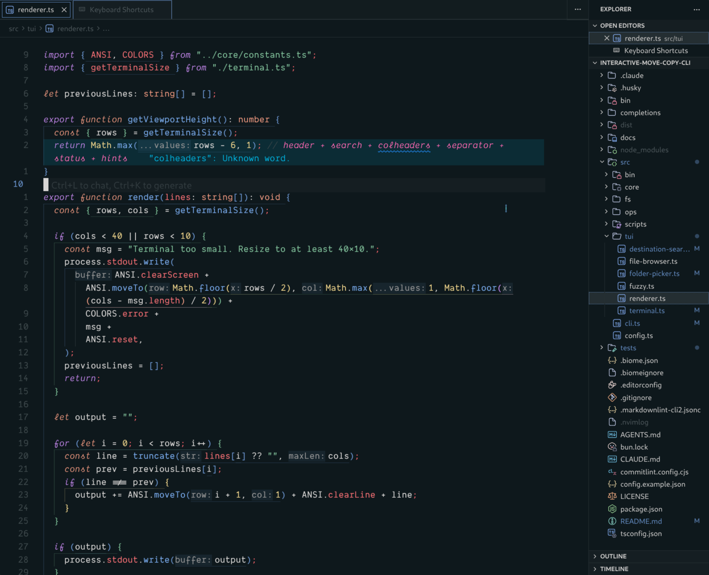
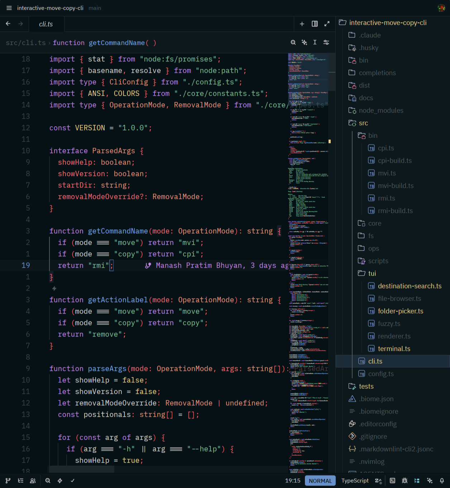
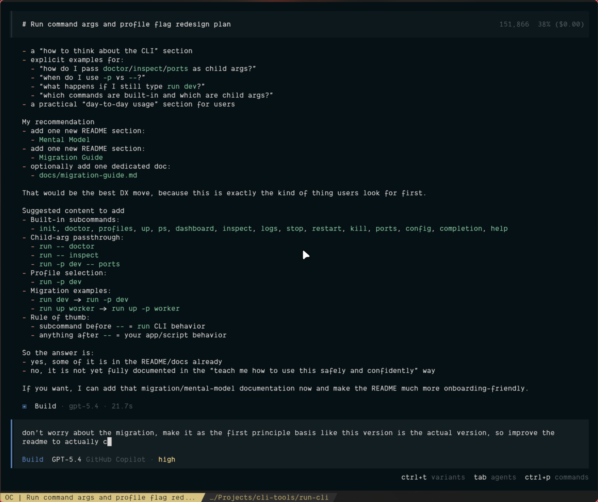
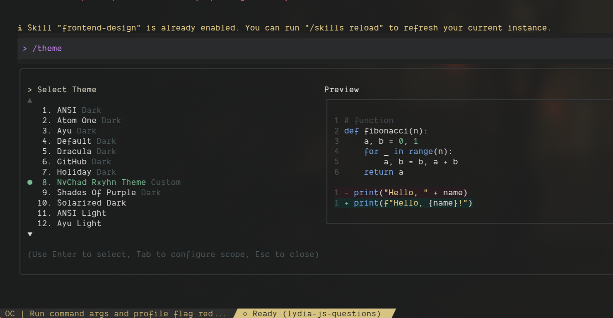

# NvChad Rxyhn Theme for VS Code, Cursor, Zed, OpenCode, and Gemini CLI

Search-friendly port of the famous `rxyhn` look for VS Code, Cursor, Zed, OpenCode, and Gemini CLI, with `NvChad` in the project name for stronger discoverability.

## Preview

### Cursor / VS Code



### Zed



### OpenCode



### Gemini CLI



## Install From GitHub

### Fastest Option For Users

If you do not want to build anything, download the committed VSIX directly from this repo:

- [nvchad-rxyhn-theme-vscode-cursor-zed-0.1.0.vsix](./nvchad-rxyhn-theme-vscode-cursor-zed-0.1.0.vsix)

Then install it manually:

```bash
code --install-extension ./nvchad-rxyhn-theme-vscode-cursor-zed-0.1.0.vsix
cursor --install-extension ./nvchad-rxyhn-theme-vscode-cursor-zed-0.1.0.vsix
```

Or use `Extensions: Install from VSIX...` in VS Code or Cursor.

For Zed, users can download the generated local theme file directly:

- [zed/rxyhn-theme.json](./zed/rxyhn-theme.json)

Then copy it into:

```bash
mkdir -p ~/.config/zed/themes
cp ./rxyhn-theme.json ~/.config/zed/themes/rxyhn-theme.json
```

Restart Zed and choose `NvChad Rxyhn Theme`.

For OpenCode, users can download the theme JSON directly:

- [opencode/rxyhn.json](./opencode/rxyhn.json)

Then copy it into:

```bash
mkdir -p ~/.config/opencode/themes
cp ./opencode/rxyhn.json ~/.config/opencode/themes/rxyhn.json
```

Restart OpenCode and select the theme (or set it in your OpenCode config file).

For Gemini CLI, users can download the theme JSON directly:

- [gemini/rxyhn.json](./gemini/rxyhn.json)

Then copy it into:

```bash
mkdir -p ~/.gemini/themes
cp ./gemini/rxyhn.json ~/.gemini/themes/rxyhn.json
```

And register the theme in `~/.gemini/settings.json`:

```jsonc
{
  "ui": {
    "theme": "NvChad Rxyhn Theme",
    "customThemes": {
      "NvChad Rxyhn Theme": {
        // paste the contents of gemini/rxyhn.json here
      }
    }
  }
}
```

Or use the automated installer (see below).

### Build From Source

Clone the repo:

```bash
git clone <your-github-repo-url>
cd nvchad-rxyhn-theme-vscode-cursor-zed
bun install
```

### VS Code

Build the VSIX and install it:

```bash
bun run package
code --install-extension ./nvchad-rxyhn-theme-vscode-cursor-zed-0.1.0.vsix
```

Then open the theme picker and choose `NvChad Rxyhn Theme`.

### Cursor

Build the VSIX and install it:

```bash
bun run package
cursor --install-extension ./nvchad-rxyhn-theme-vscode-cursor-zed-0.1.0.vsix
```

Then open the theme picker and choose `NvChad Rxyhn Theme`.

### Zed

Build the local Zed theme file and install it:

```bash
bun run build
mkdir -p ~/.config/zed/themes
cp ./zed/rxyhn-theme.json ~/.config/zed/themes/rxyhn-theme.json
```

Then restart Zed and choose `NvChad Rxyhn Theme` from the theme picker.

If you prefer the helper script:

```bash
bun run install:zed
```

### OpenCode

Build and install the OpenCode theme:

```bash
bun run build
bun run install:opencode
```

Manual alternative:

```bash
mkdir -p ~/.config/opencode/themes
cp ./opencode/rxyhn.json ~/.config/opencode/themes/rxyhn.json
```

Restart OpenCode and select the theme in its settings.

### Gemini CLI

Build and install the Gemini CLI theme:

```bash
bun run build
bun run install:gemini
```

This copies the theme to `~/.gemini/themes/` and registers it under `ui.customThemes` in `~/.gemini/settings.json`.

Manual alternative:

```bash
mkdir -p ~/.gemini/themes
cp ./gemini/rxyhn.json ~/.gemini/themes/rxyhn.json
```

Then add the theme to `~/.gemini/settings.json` under `ui.customThemes` (see the install section above for the JSON structure).

## Release-Friendly Option

If you publish GitHub Releases, attach `nvchad-rxyhn-theme-vscode-cursor-zed-0.1.0.vsix` to a release. That gives VS Code and Cursor users a simple download-and-install path without building locally.

Zed users can download `zed/rxyhn-theme.json` from the repo or a release and place it in `~/.config/zed/themes`.

## Outputs

- VS Code / Cursor theme JSON: `themes/rxyhn-color-theme.json`
- VS Code / Cursor VSIX: `nvchad-rxyhn-theme-vscode-cursor-zed-0.1.0.vsix`
- Zed local theme JSON: `zed/rxyhn-theme.json`
- OpenCode theme JSON: `opencode/rxyhn.json`
- Gemini CLI theme JSON: `gemini/rxyhn.json`

All generated artifacts come from the shared palette and mappings in `src/theme.ts`.

## Adding Another Theme Later

This codebase is now set up so you can add more themes without rewriting the VS Code and Zed mapping logic.

The workflow is:

1. Add a new theme entry to `themeCatalog` in `src/theme.ts`
2. Give it a unique `id`, `displayName`, `base30`, and `base16`
3. Run:

```bash
bun run build
```

That will automatically:

- generate `themes/<id>-color-theme.json`
- generate `zed/<id>-theme.json`
- generate `opencode/<id>.json`
- generate `gemini/<id>.json`
- sync `package.json` so the VS Code extension contributes the new theme

## Build

```bash
bun run build
```

This regenerates:

- `themes/rxyhn-color-theme.json`
- `zed/rxyhn-theme.json`
- `opencode/rxyhn.json`
- `gemini/rxyhn.json`

## Local Dev Workflow

Build or rebuild the extension package:

```bash
bun run package
```

Install the VSIX locally:

```bash
code --install-extension ./nvchad-rxyhn-theme-vscode-cursor-zed-0.1.0.vsix
cursor --install-extension ./nvchad-rxyhn-theme-vscode-cursor-zed-0.1.0.vsix
```

Or install manually with `Extensions: Install from VSIX...`.

After installation, choose `NvChad Rxyhn Theme` from the color theme picker.

Generate the Zed theme file:

```bash
bun run build
```

Install it into your local Zed themes directory:

```bash
bun run install:zed
```

Manual alternative:

```bash
mkdir -p ~/.config/zed/themes
cp ./zed/rxyhn-theme.json ~/.config/zed/themes/rxyhn-theme.json
```

Then restart Zed and select `NvChad Rxyhn Theme` from the theme picker.

## Recommended Settings

Some parts of a full editor rice are not themeable by extensions or local theme files. These settings get the editors closer to the intended feel.

VS Code / Cursor:

```jsonc
{
  "workbench.colorTheme": "NvChad Rxyhn Theme",
  "editor.semanticHighlighting.enabled": true,
  "editor.bracketPairColorization.enabled": true,
  "editor.guides.bracketPairs": "active",
  "editor.cursorSmoothCaretAnimation": "off",
  "editor.renderLineHighlight": "gutter",
  "terminal.integrated.minimumContrastRatio": 1
}
```

Zed:

```jsonc
{
  "relative_line_numbers": "enabled",
  "vim_mode": true,
  "theme": {
    "mode": "system",
    "dark": "NvChad Rxyhn Theme",
    "light": "Catppuccin Mocha"
  }
}
```

Set your preferred Nerd Font separately if you want the rest of your setup to visually track your NvChad environment.

## Attribution

The palette is based on NvChad Base46's `rxyhn` theme and the original `rxyhn` rice credits noted upstream.
Review upstream licensing and attribution requirements before publishing to a marketplace or extension registry.
