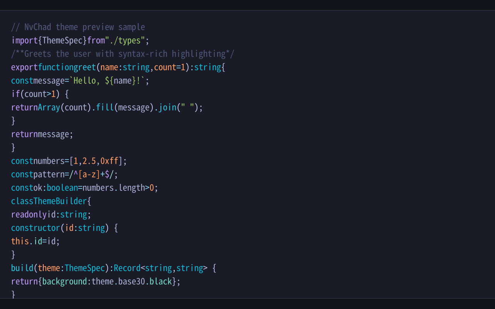
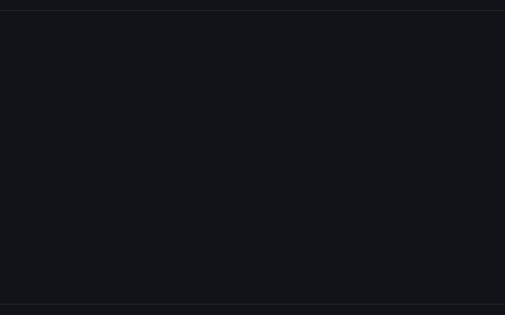
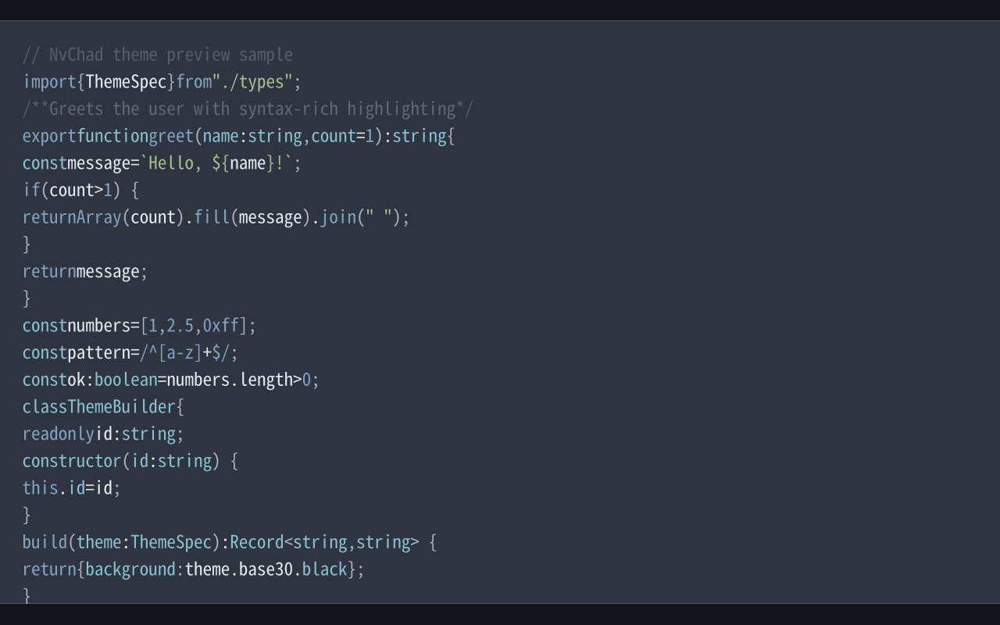
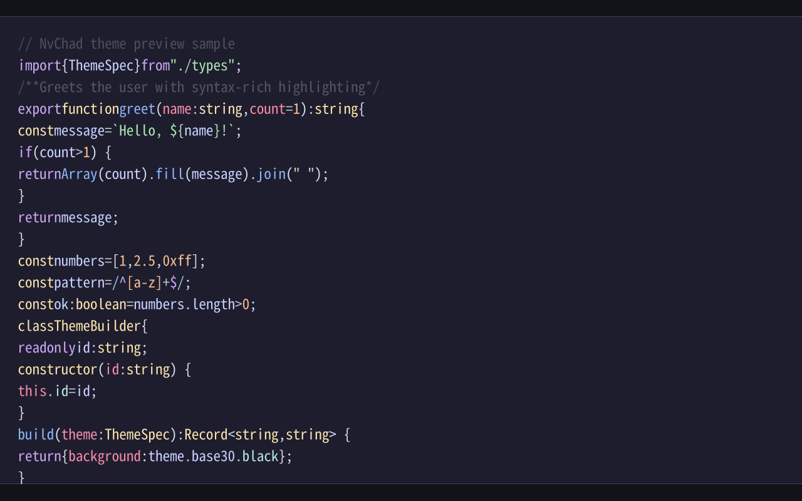

# NvChad Themes — Zed Extension

All 94 [NvChad base46](https://github.com/NvChad/base46) themes in one Zed theme extension.

## Screenshots

Syntax previews (Shiki + this repo's theme engine):

| Tokyonight | Kanagawa |
| :---: | :---: |
|  |  |

| Nord | Catppuccin |
| :---: | :---: |
|  |  |

More heroes: `screenshots/{tokyonight,kanagawa,nord,catppuccin,rxyhn,onedark,gruvbox,everforest}.png`

Regenerate after theme changes (from repo root):

```bash
bun run previews
```

## Install (end users)

### Download the extension zip

Get [`nvchad-themes-zed-extension-1.0.0.zip`](../dist/nvchad-themes-zed-extension-1.0.0.zip) from [`dist/`](../dist/) or [GitHub Releases](https://github.com/KitsuneKode/nvchad-themes/releases/latest).

1. **Extract** the zip. The folder you pick in Zed must contain **`extension.toml`** at its root:

   ```
   nvchad-themes-zed-extension-1.0.0/
     extension.toml
     LICENSE
     README.md
     themes/
       nvchad-themes.json    # all 94 variants
       tokyonight-theme.json # per-theme imports
     screenshots/
   ```

2. In Zed: **`zed: install dev extension`**
3. Select the **extracted folder** (not `themes/` alone, not the git repo root unless you cloned).
4. **`zed: reload`** or restart Zed.
5. Theme picker → search **NvChad** → e.g. **NvChad Tokyonight**.

Verify checksum: `sha256sum -c ../dist/checksums.sha256` (from `dist/`).

### Alternative: user theme JSON only

Copy [`nvchad-themes-zed-user-1.0.0.json`](../dist/nvchad-themes-zed-user-1.0.0.json) to:

- Linux: `~/.config/zed/themes/`
- macOS: `~/Library/Application Support/Zed/themes/`

No `extension.toml` needed; Zed watches that directory for JSON theme families.

```bash
bun run install:zed --all   # from a clone
bun run install:zed nord    # single theme
```

## Install (contributors)

```bash
bun run install:zed-dev
```

Then **`zed: install dev extension`** → select **`zed-extension/`** in this repository.

## Project panel & git colors

Zed colors file tree labels by git status when `project_panel.git_colors` is enabled (default):

| Status | Color role |
|--------|------------|
| Normal file | `text.muted` |
| Gitignored | `ignored` (dimmer) |
| Modified | `modified` (yellow/orange) |
| Added / untracked | `created` (green) |

Hero themes **NvChad Tokyonight** and **NvChad Kanagawa** pin chrome values from [zed-tokyo-night](https://github.com/ssaunderss/zed-tokyo-night) and [zed-kanagawa](https://github.com/ethangilmore/zed-kanagawa).

After updating themes: `bun run install:zed-dev` then **`zed: reload`**.

## Layout

```
zed-extension/
  extension.toml          # id = "nvchad-themes"
  LICENSE
  README.md
  screenshots/            # hero PNG previews (bundled in dist zip)
  themes/
    nvchad-themes.json    # one family, 94 variants
    {id}-theme.json       # Theme Builder import
```

Zed auto-discovers every `.json` in `themes/`. Theme-only extensions need no Rust code.

## Troubleshooting

**Themes not in picker**

- Dev extension path must contain `extension.toml`.
- Run **`zed: reload`** after install.
- Check **`zed: open log`** for JSON parse errors.

**Flat panels / wrong syntax**

- Re-run `bun run build` and reinstall the dev extension.
- Stale bundle is the usual cause.

**Git colors too subtle**

- Confirm **`project_panel.git_colors`**: `true`.
- Use an **NvChad** variant (e.g. NvChad Tokyonight), not a separate Tokyo Night extension.

**Diagnostics**

- `zed: open log`
- `zed --foreground` from a terminal

## Regenerating

```bash
bun run build
bun run previews          # optional: refresh screenshots/
bun run package           # dist zip includes themes/ + screenshots/
```

## Publishing

See [Developing Extensions — Publishing](https://zed.dev/docs/extensions/developing-extensions#publishing-your-extension) and the root [PUBLISHING.md](../PUBLISHING.md).
